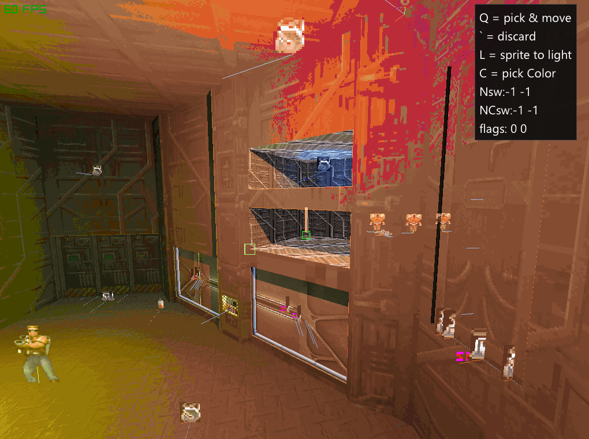

# Build2 - next iteration
Welcome to the repo of second life of Build2
Build 2 by Ken Silverman: https://www.advsys.net/ken/build.htm  
This is port of the engine onto raylib and hardware render.
## Contacts
Want to develop? - contact me on discord server here: https://discord.gg/wmM444UU  
Want just daily updates? - welcome to duke4.net discord: https://discord.gg/ChAnq8wt  
also im looking for a job, any jobs pls? my contact's here https://dave-astator.com  

For now our dev team is me and Jaba, and i can find task for everyone.  

# License info
NON-COMMERCIAL OPEN SOURCE LICENSE

Copyright (c) 2025-2026 Eugene Bolshakow

This software is provided under the following terms:

1. NON-COMMERCIAL USE ONLY
   This software may be used, modified, and distributed for non-commercial 
   purposes only. Commercial use requires explicit written permission from 
   the copyright holder.

2. DEPENDENCY NOTICE
   This software depends on Ken Silverman's Build2 engine. Users must comply 
   with Build2's licensing terms as well: [Build2.txt](https://github.com/EugeneDevastator/duke3d-build2/blob/f9b587ee81e0c85e7a590d2cb0d2c84422a7c724/build2.txt#L398)

3. COMMERCIAL LICENSING
   For commercial use, contact _omnispark(at)gmail(dot)com_ for licensing terms. 
   Commercial also requires permission from Ken Silverman for Build2 components. 
   Ken's homepage and contact info: https://www.advsys.net/ken/

4. DISTRIBUTION
   Redistributions must include this license notice and maintain the 
   non-commercial restriction.

5. NO WARRANTY
   This software is provided "as is" without warranty of any kind.
